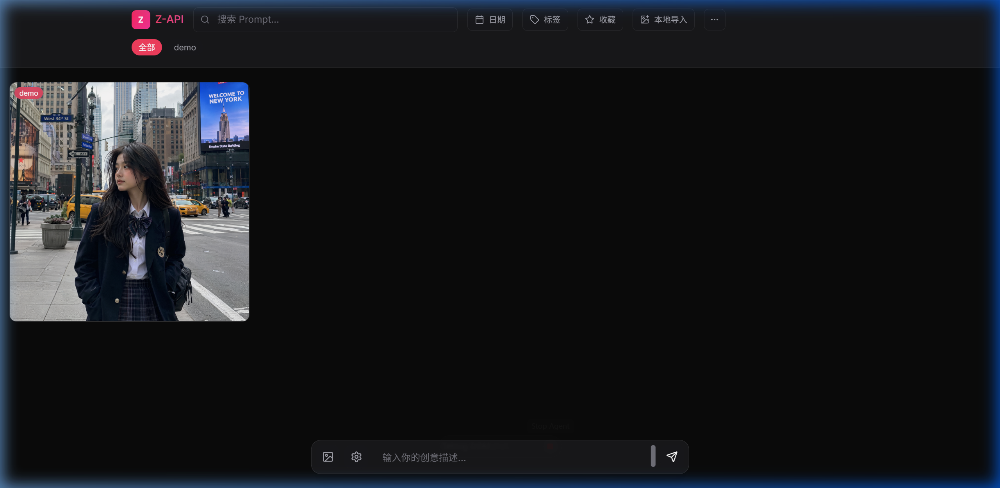

# ProxyCanvas

ProxyCanvas 是一个本地优先的 AI 图片工作流项目，用一个统一的 Web 工作台聚合多个图像生成后端。

它不是另一个反代服务本体，而是放在 APIMart、ChatGPT2API、CLIProxyAPI、Nanobanana2、Sousaku、LumaLabs 等服务前面的图片生成控制台：负责提交任务、管理参考图、保存结果、本地图廊、账号状态、任务记录和日常运维。

- `backend_v2/`：Python Flask 后端，负责图片接口、provider 适配、任务系统、账号配置和本地数据读写
- `frontend_v2/`：Vite + React 前端，负责图片工作台、图廊、任务页和账号页
- `config/`：本地 provider 配置、token 配置和账号缓存
- `sdk/`：Sousaku、LumaLabs 等 provider 的本地 SDK 封装

前端开发服务器通过 Vite 代理访问后端；生成图片、任务数据、缩略图和 SQLite 数据库默认保存在本机。

## 核心功能

- 聚合多种图片生成后端：APIMart、ChatGPT2API、CLIProxyAPI、Nanobanana2、Sousaku、LumaLabs
- 支持文本生图、参考图生成、连续编辑、蒙版/选区编辑等图片工作流
- 支持本地图廊：图片导入、收藏、标签、Prompt 元数据、缩略图缓存和结果复用
- 支持任务记录：后台任务、状态轮询、错误信息、结果路径和任务详情
- 支持账号运维：Sousaku token 导入、账号刷新、启用/禁用、删除和余额/额度展示
- 支持多 provider 配置：API key、base URL、保存目录、代理、并发限制、模型 credit 估算
- 支持 SQLite 存储任务与图廊数据，适合长期本地使用
- 支持本地启动脚本，一次启动常用外部服务、后端和前端

## 图片工作台

ProxyCanvas 的图片工作台围绕日常生成流程设计：

- 在同一界面选择 provider、模型、比例、质量和参考图
- 查看任务状态、生成结果和错误信息
- 将结果图继续作为编辑源图
- 打开选区编辑器进行局部重绘
- 复制 Prompt、复用参考图、保存结果到本地图廊
- 在图廊中按日期、标签、收藏和导入来源管理图片

## 界面预览

| 工作台预览 |
| --- |
|  |

## 支持的外部服务

ProxyCanvas 本身负责统一界面、任务管理和本地保存；真正的图片生成由外部 provider 完成。

不同 provider 能力不同：有的适合免费账号，有的支持更高分辨率，有的支持特定模型或账号池。ProxyCanvas 的作用是把这些生成来源接到同一个工作台里，方便按场景切换。

### APIMart

APIMart 是一个 API 中转站，可以接入多种图像模型。ProxyCanvas 当前主要用于调用 APIMart 的 GPT-IMAGE-2 和 Nanobanana 相关模型。

APIMart API Key 在 `backend_v2/config.py` 中配置：

```python
API_KEY = "your-apimart-api-key"
API_BASE_URL = "https://api.apimart.ai"
```

### ChatGPT2API

[ChatGPT2API](https://github.com/basketikun/chatgpt2api) 是一个本地反代工具，可以把 ChatGPT 网页侧能力封装成本地 OpenAI-compatible API。

在图片场景中，它主要用于 GPT-IMAGE-2 模型。当前适合 ChatGPT Free 账号使用，最大输出分辨率通常为 1080P。

如果 ChatGPT2API 运行在 `8000` 端口，可以配置：

```python
OPENAI_API_KEY = "chatgpt2api"  # 填 ChatGPT2API 本地服务配置的 key，常见默认值是 chatgpt2api
OPENAI_BASE_URL = "http://127.0.0.1:8000/v1"
OPENAI_IMAGE_MODEL = "gpt-image-2"
```

### CLIProxyAPI

[CLIProxyAPI](https://github.com/router-for-me/CLIProxyAPI) 可以把 Gemini CLI、Antigravity、ChatGPT Codex、Claude Code、Grok Build 等工具聚合为标准兼容接口。

在 ProxyCanvas 的图片场景中，CLIProxyAPI 使用的是 Codex 侧的 GPT-IMAGE-2 能力。它可以输出更高分辨率图片，最大可到 4K，但质量档位和审核参数通常不可设置，并且需要 ChatGPT Plus 会员账号。

```python
CLIPROXY_API_KEY = "your-cliproxy-api-key"  # 填 CLIProxyAPI 本地服务配置的 API key
CLIPROXY_BASE_URL = "http://127.0.0.1:8317/v1"
```

### Nanobanana2

Nanobanana2 用于接入 [Antigravity-Manager](https://github.com/lbjlaq/Antigravity-Manager) 提供的 Nanobanana2 模型能力。

如果本地 Nanobanana2 服务运行在 `9000` 端口，可以配置。`NANOBANANA2_BASE_URL` 对应的是 Antigravity-Manager / Nanobanana2 服务地址和端口，请按实际端口修改：

```python
NANOBANANA2_API_KEY = "your-nanobanana2-api-key"  # 填 Nanobanana2 / Antigravity-Manager 服务配置的 key
NANOBANANA2_BASE_URL = "http://127.0.0.1:8045"
```

### Sousaku

Sousaku 需要你自己的账号 token。ProxyCanvas 会读取 token、刷新账号信息，并在生成时按配置选择可用账号。

账号配置位于：

```text
config/sousaku_config.json
```

把自己的 token 填入 `tokens` 数组即可。真实 token 不要提交到仓库。

示例：

```json
{
  "tokens": [
    "your-sousaku-token",
    "your-second-sousaku-token"
  ],
  "save_dir": "data/sousaku",
  "accounts_path": "sousaku_accounts.json"
}
```

`tokens` 可以填一个或多个 Sousaku 账号 token。ProxyCanvas 会根据配置进行账号刷新和轮换。

### LumaLabs

LumaLabs 需要你自己的临时 `wos_session`。这个值来自网页会话，等同于账号凭据，可能会过期。

相关配置位于：

```text
config/lumalabs_config.json
```

`wos_session` 这类 web session cookie 请当作密钥处理，不要提交到仓库。

## 仓库结构

```text
.
├── assets/
│   └── web_ui.png
├── backend_v2/
│   ├── routes/
│   ├── services/
│   │   └── jobs/
│   ├── app.py
│   ├── config.py
│   └── requirements.txt
├── config/
│   ├── lumalabs_config.example.json
│   ├── lumalabs_config.json
│   ├── sousaku_accounts.json
│   └── sousaku_config.json
├── frontend_v2/
│   ├── src/
│   ├── package.json
│   └── vite.config.ts
├── sdk/
│   ├── lumalabs/
│   └── sousaku/
├── server_port.json
├── start.bat
└── README.md
```

## 环境要求

- Python 3.10+
- Node.js 20+
- npm 10+
- Windows 本地开发环境优先，macOS / Linux 可手动启动前后端

如果你使用 `start.bat`，脚本默认只启动 ProxyCanvas 后端和前端。CLIProxyAPI、ChatGPT2API 需要在脚本顶部配置本机路径后才会启动。

## 获取项目

```powershell
git clone <your-repo-url>
cd ProxyCanvas
```

如果你是从本地 APIMart 副本整理出来的版本，直接进入项目目录即可：

```powershell
cd F:\CodeProject\ProxyCanvas
```

## 本地开发

安装后端依赖：

```powershell
cd backend_v2
pip install -r requirements.txt
```

安装前端依赖：

```powershell
cd frontend_v2
npm install
```

启动后端：

```powershell
cd backend_v2
python -u app.py
```

启动前端：

```powershell
cd frontend_v2
npm run dev
```

默认地址：

```text
前端: http://localhost:5380
后端: http://localhost:5700
```

健康检查和 API 路由由 Flask 后端提供，前端通过 Vite proxy 转发 `/api` 请求到后端。

## 一键启动

Windows 可以直接运行：

```text
start.bat
```

默认脚本会尝试启动：

- CLIProxyAPI，前提是你在脚本顶部配置了 `CLIPROXY_DIR`
- ChatGPT2API，前提是你在脚本顶部配置了 `CHATGPT2API_DIR`
- ProxyCanvas 后端
- ProxyCanvas 前端

你大概率需要根据自己的机器修改：

- CLIProxyAPI 所在目录
- ChatGPT2API 所在目录
- 可选 conda 环境名
- 前后端端口
- 浏览器启动方式

默认情况下，`start.bat` 不会启用 conda，会直接使用系统 PATH 里的 `python` 启动后端：

```bat
set "BACKEND_CONDA_ENV="
set "BACKEND_CMD=python -u app.py"
```

如果你的 Python 依赖装在 conda 环境里，需要自己填写环境名：

```bat
set "BACKEND_CONDA_ENV=my_env"
```

CLIProxyAPI / ChatGPT2API 的路径也是可选配置。示例：

```bat
set "CLIPROXY_DIR=D:\apps\CLIProxyAPI"
set "CHATGPT2API_DIR=D:\Code\chatgpt2api"
set "CHATGPT2API_CONDA_ENV="
set "CHATGPT2API_CMD=python -u main.py"
```

如果 ChatGPT2API 也需要 conda，再把 `CHATGPT2API_CONDA_ENV` 改成你自己的环境名。若你的 ChatGPT2API 项目使用 `uv` 启动，可以改成：

```bat
set "CHATGPT2API_CMD=uv run main.py"
```

如果不配置外部服务路径，脚本会跳过对应服务，只启动 ProxyCanvas 后端和前端。

## 配置文件

主要配置文件：

- `backend_v2/config.py`：后端端口、provider 地址、API Key、保存路径、任务并发限制和 SQLite 路径
- `server_port.json`：前后端共享端口配置，Vite 会读取它来代理后端 API
- `config/sousaku_config.json`：Sousaku token、保存路径、模型 credit 估算和 token 轮换策略
- `config/sousaku_accounts.json`：Sousaku 账号缓存
- `config/lumalabs_config.json`：LumaLabs session 账号配置

常用 API Key 在 `backend_v2/config.py` 中填写：

```python
API_KEY = "your-apimart-api-key"                  # APIMart 后台获取
OPENAI_API_KEY = "chatgpt2api"                    # ChatGPT2API 本地服务配置的 key
CLIPROXY_API_KEY = "your-cliproxy-api-key"         # CLIProxyAPI 本地服务配置的 API key
NANOBANANA2_API_KEY = "your-nanobanana2-api-key"  # Nanobanana2 / Antigravity-Manager 服务配置的 key
```

如果需要代理，可在 `backend_v2/config.py` 中配置：

```python
HTTP_PROXIES = {
    "http": "http://127.0.0.1:7890",
    "https": "http://127.0.0.1:7890",
}
```

## 数据存储

ProxyCanvas 当前主要使用本地文件和 SQLite：

- 任务数据库：`data/jobs.sqlite`
- 图廊数据库：`data/gallery.sqlite`
- Sousaku 账号缓存：`config/sousaku_accounts.json`
- LumaLabs 账号配置：`config/lumalabs_config.json`
- 生成图片和导入图片：由 provider 配置中的保存目录决定
- 前端依赖：`frontend_v2/node_modules/`，不入库
- 前端构建产物：`frontend_v2/dist/`，不入库

默认运行数据不应该提交到 Git。

## 构建

构建前端：

```powershell
cd frontend_v2
npm run build
```

当前项目还不是单二进制交付形态。如果后续要做正式发布，可以考虑：

- 构建 `frontend_v2/dist`
- 让 Flask 后端托管静态资源
- 打包 Python 运行环境或提供 Docker 镜像
- 将示例配置和真实配置分离

## 检查

前端检查：

```powershell
cd frontend_v2
npm run lint
npm run build
```

后端基础检查：

```powershell
cd backend_v2
python -m py_compile app.py config.py
```

如果修改了 provider、任务系统或账号管理逻辑，建议手动验证：

- 生成任务提交
- 任务状态轮询
- 图片结果保存
- 图廊刷新
- Sousaku token 导入、刷新、禁用和删除

## 主要接口

常用接口按功能大致分为：

- 图片生成：`POST /api/generate`、`POST /api/generate-openai`、`POST /api/generate-cliproxy`、`POST /api/generate-nanobanana2`、`POST /api/generate-sousaku`
- 任务管理：`GET /api/jobs`、`POST /api/jobs`、`GET /api/jobs/<job_id>`、`POST /api/jobs/<job_id>/retry`、`POST /api/jobs/<job_id>/cancel`
- 图廊管理：`GET /api/gallery`、`POST /api/gallery`、`DELETE /api/gallery/<image_id>`、`POST /api/gallery/import`
- 本地文件：`GET /api/serve-image`、`GET /api/thumbnail`、`POST /api/open-folder`
- provider 能力：`GET /api/capabilities`
- provider 账号：`GET /api/provider-accounts`、`POST /api/provider-accounts/sousaku/tokens`、刷新、启用/禁用、删除 Sousaku 账号
- 上传与代理：`POST /api/upload-image`、`GET /api/proxy-image`、`POST /api/process-url`

具体接口以 `backend_v2/app.py` 和 `backend_v2/routes/` 中的实现为准。

## 本地数据与敏感信息

以下内容不要提交到 Git：

- 真实 API Key
- Sousaku token
- LumaLabs `wos_session`
- OpenAI-compatible API key
- 账号缓存中的真实账号信息
- `data/*.sqlite`
- 生成图片、导入图片、缩略图缓存
- `frontend_v2/node_modules/`
- `frontend_v2/dist/`
- 日志、临时文件和本地测试输出

如果密钥曾经被提交、截图或分享过，建议直接轮换或废弃，而不是只从文件中删除。

## 社区与上游

ProxyCanvas 适配和依赖多个外部项目或服务，包括但不限于：

- [ChatGPT2API](https://github.com/basketikun/chatgpt2api)
- [CLIProxyAPI](https://github.com/router-for-me/CLIProxyAPI)
- [Antigravity-Manager](https://github.com/lbjlaq/Antigravity-Manager)

这些项目的行为、接口和可用性可能随时间变化。若上游变更，ProxyCanvas 的适配层也可能需要同步调整。

## 免责声明

本项目仅供个人学习、技术研究与非商业性技术交流使用。

严禁将本项目用于任何商业用途、盈利性使用、批量滥用、自动化滥用或规模化调用。

严禁将本项目用于生成、传播或协助生成违法、暴力、色情、未成年人相关内容，或用于诈骗、欺诈、骚扰等非法或不当用途。

严禁将本项目用于任何违反 OpenAI、APIMart、Sousaku、LumaLabs、ChatGPT2API、CLIProxyAPI、Antigravity-Manager 或其他相关平台服务条款、当地法律法规或平台规则的行为。

使用者应自行承担全部风险，包括但不限于账号被限制、临时封禁、永久封禁、额度损失、数据丢失以及因违规使用导致的法律责任。

使用本项目即视为你已充分理解并同意本免责声明全部内容；如因滥用、违规或违法使用造成任何后果，均由使用者自行承担。

> 重要提醒：本项目涉及多个第三方服务和本地反代工具。请勿使用自己的重要账号、常用账号或高价值账号进行高风险测试。

## License

MIT License
